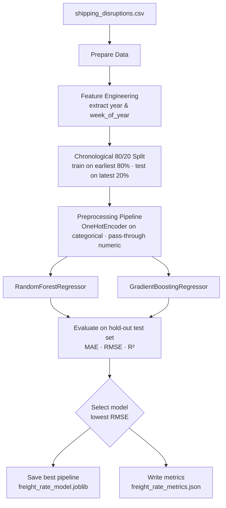
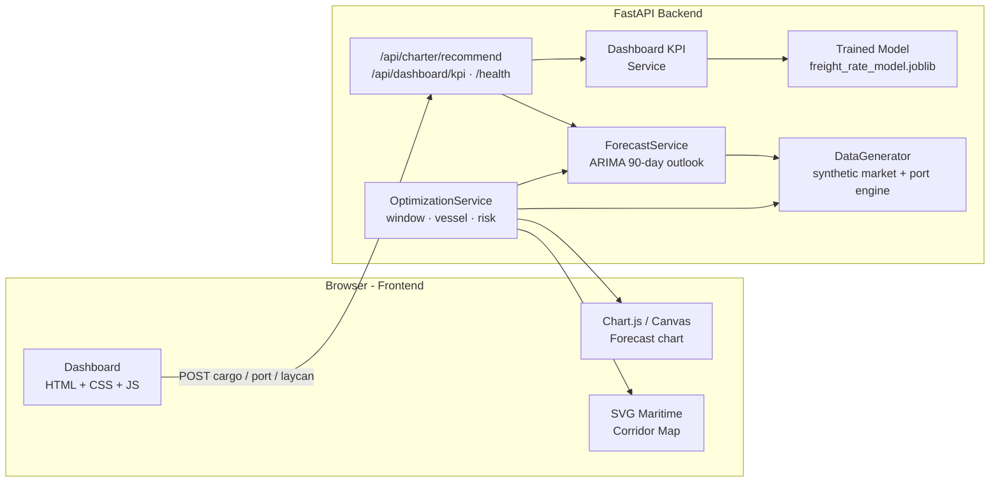
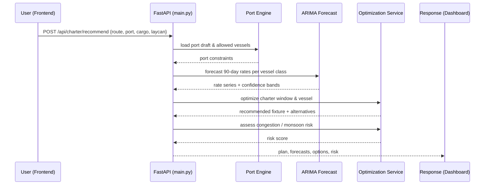
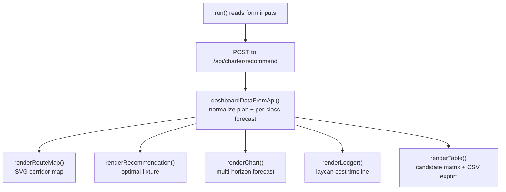

# CharterSense — Intelligent Freight Rate Forecasting & Vessel Charter Optimization

> **SIH 2026 Problem Statement ID:** 26006  
> **Organization:** Ministry of Steel — Steel Authority of India Limited (SAIL)  
> **Domain:** Software · Maritime Logistics & Supply Chain Procurement

---

## 🚢 Overview

**CharterSense** is an AI-powered decision support platform built for **SAIL (Steel Authority of India Limited)** to optimize ocean freight procurement for bulk raw material imports (coking coal, iron ore, limestone) shipped to the East Coast of India (Visakhapatnam, Paradip, Haldia).

The system replaces manual, error-prone daily market exploration with:
- **Time-Series Forecasting Engine:** A validated ARIMA model forecasts up to 90 days of freight trajectories across Capesize, Panamax, and Supramax vessels. The included data is deterministic synthetic demo data, not live market data.
- **Port Draft & Berthing Feasibility Solver:** Enforces Salt Water Draft (SWD) limitations and automatically excludes non-feasible vessel classes (e.g. Capesize restrictions at Haldia).
- **Laycan Procurement Optimizer:** Evaluates laytime windows, base freight, late delivery penalties, and congestion demurrage risks to pinpoint the minimum net procurement fixture.
- **Interactive Maritime Radar Map:** Visualizes shipping corridors from major global loading ports (Port Hedland AU, Richards Bay SA, Samarinda ID, Tubarão BR) to Indian discharge terminals.

---

## 💻 Tech Stack

- **Backend:** Python 3 (FastAPI, NumPy, Pandas, Statsmodels ARIMA, Uvicorn)
- **Frontend:** HTML5, CSS3 Enterprise Design System, JavaScript (ES6+), Chart.js & HTML5 Canvas
- **Architecture:** FastAPI API with a static HTML/CSS/JavaScript dashboard. The dashboard sends all optimization requests to the backend so displayed recommendations use one calculation path.

---

## 🧠 Model Training Logic

The offline forecasting model is trained from `shipping_disruptions.csv` by `train_freight_model.py`, which saves the winning pipeline to `models/freight_rate_model.joblib` and its evaluation to `models/freight_rate_metrics.json`.



| Step | Component | Details |
|------|-----------|---------|
| **Data** | `shipping_disruptions.csv` | Weekly time series of freight-rate drivers |
| **Target** | `freight_rate_usd` | Continuous value to predict |
| **Features** | Categorical | `port`, `region`, `shipping_mode` |
| **Features** | Numeric | `year`, `week_of_year`, `avg_wait_days`, `disruption_index`, `fuel_price_usd`, `backlog_teu`, `on_time_pct` |
| **Split** | Chronological | First 80% train / last 20% test (no shuffle — prevents look-ahead) |
| **Preprocessing** | `ColumnTransformer` | `OneHotEncoder(handle_unknown="ignore")` + numeric passthrough |
| **Models** | Ensemble | `RandomForestRegressor` vs `GradientBoostingRegressor` |
| **Selection** | Lowest RMSE | Best candidate persisted as the production pipeline |
| **Outputs** | `models/` | `.joblib` pipeline + `freight_rate_metrics.json` |

> **Note:** The trained disruption model explains general shipping-disruption patterns, not route-specific bulk-vessel quotes. The interactive dashboard's forward forecasts are generated live by a separate ARIMA time-series engine on synthetic demo data.

---

## 🏗️ Website Architecture & Data Pipeline

CharterSense is a **FastAPI backend + static HTML/CSS/JavaScript frontend**. All optimization decisions are computed server-side so the displayed recommendations always come from a single calculation path.



### Request → Response Flow (Run Optimization Engine)



### Frontend Rendering Pipeline



### Key Endpoints

| Endpoint | Method | Purpose |
|----------|--------|---------|
| `/` , `/ui` | GET | Serve the dashboard (`index.html`) |
| `/health` | GET | Health check for the ML server |
| `/api/dashboard/kpi` | GET | Dashboard KPIs + trained model metrics |
| `/api/charter/recommend` | POST | Full charter optimization recommendation |
| `style.css` / `script.js` | GET | Static assets |

---

## 🚀 Getting Started

### Option 1: Full-Stack Mode (FastAPI + Web UI)

1. **Install Dependencies:**
   ```bash
   pip install -r requirements.txt
   ```

2. **Start the Platform:**
   ```bash
   python main.py
   ```

3. **Access in Browser:**
   - Web Platform: [http://localhost:8000](http://localhost:8000)
   - Interactive Swagger API Documentation: [http://localhost:8000/docs](http://localhost:8000/docs)

---

### Run tests

```bash
python -m pytest -q
```

Open the dashboard through FastAPI at `http://localhost:8000`; opening `index.html` directly cannot access the optimization API.

---

## 👥 Authors

Developed for **Smart India Hackathon 2026 (PS 26006)**.
